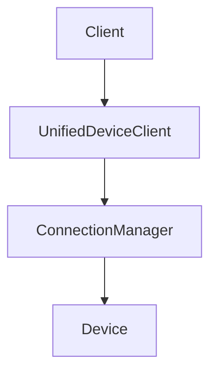

# Assets Directory

This directory contains all static assets used in the Hydrogen documentation.

## Directory Structure

- `images/` - Screenshots, photos, and other bitmap images
- `diagrams/` - Architecture diagrams, flowcharts, and technical illustrations

## File Naming Conventions

### Images
- Use lowercase with hyphens: `device-connection-flow.png`
- Include descriptive names: `unified-architecture-overview.jpg`
- Use appropriate file extensions: `.png` for screenshots, `.jpg` for photos

### Diagrams
- Use lowercase with hyphens: `protocol-communication-diagram.svg`
- Prefer vector formats (`.svg`) when possible
- Include source files for editable diagrams (`.drawio`, `.vsd`, etc.)

## Usage in Documentation

Reference assets using relative paths from the documentation file:

```markdown

```

For diagrams:

```markdown

```

## Asset Guidelines

1. **Optimize file sizes** - Compress images appropriately
2. **Use descriptive alt text** - For accessibility
3. **Maintain consistency** - Use similar styling across diagrams
4. **Version control** - Include source files when possible
5. **Attribution** - Include credits for external assets

## Supported Formats

### Images
- PNG (preferred for screenshots and graphics with transparency)
- JPG (preferred for photographs)
- WebP (for modern browsers, smaller file sizes)
- GIF (for simple animations)

### Diagrams
- SVG (preferred for scalable vector graphics)
- PNG (for raster diagrams)
- PDF (for complex technical diagrams)

## Tools Recommendations

### Diagram Creation
- [Draw.io](https://draw.io) - Free online diagramming tool
- [Lucidchart](https://lucidchart.com) - Professional diagramming
- [Mermaid](https://mermaid-js.github.io/) - Text-based diagrams (supported in MkDocs)

### Image Editing
- [GIMP](https://gimp.org) - Free image editor
- [Photoshop](https://adobe.com/photoshop) - Professional image editor
- [TinyPNG](https://tinypng.com) - Image compression

## Mermaid Diagrams

MkDocs supports Mermaid diagrams directly in markdown:



Use Mermaid for simple diagrams that can be version-controlled as text.
